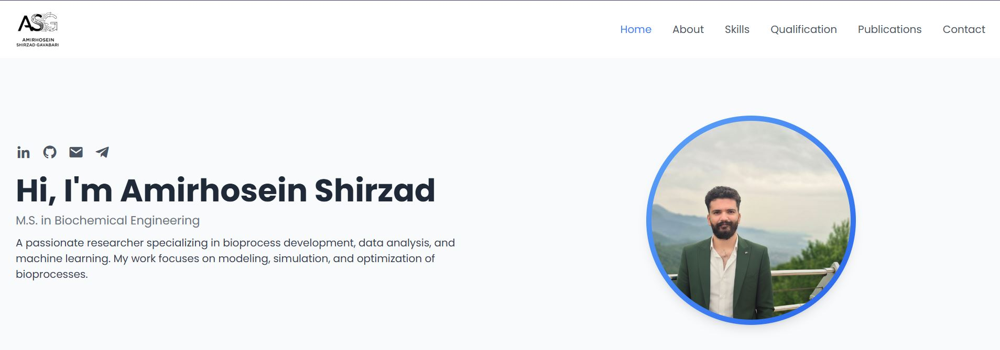

# Amirhosein Shirzad Gavabari - Academic Portfolio

This is the source code for my personal academic and professional portfolio website. It is a single-page application designed to showcase my skills, qualifications, projects, and publications in the field of Biochemical Engineering.

**Live Demo:** [My Personal Website](https://amirhoseinshirzad.github.io/)

 

---

### Features

-   **Responsive Design:** Fully responsive layout that works on desktop, tablet, and mobile devices.
-   **Smooth Scrolling:** Clean, smooth navigation between sections.
-   **Dynamic Skills Section:** Skills are rendered dynamically from a JavaScript object, making them easy to update.
-   **Interactive Tabs:** The "Qualification" section features tabs to switch between Education, Experience, and Projects.
-   **Active Link Highlighting:** The navigation link for the current section is automatically highlighted on scroll.
-   **Clean & Modern UI:** Built with Tailwind CSS for a modern and professional look.

---

### Technologies Used

-   **HTML5:** For the structure and content of the website.
-   **CSS3:** For custom styling and animations.
-   **Tailwind CSS:** A utility-first CSS framework for rapid UI development.
-   **JavaScript (ES6):** For interactivity, dynamic content rendering, and DOM manipulation.
-   **Boxicons:** For a rich set of high-quality icons.
-   **Google Fonts:** For the 'Poppins' typeface.


---

### Setup

To run this project locally, simply clone the repository and open the `index.html` file in your web browser.

```bash
git clone https://github.com/AmirhoseinShirzad/AmirhoseinShirzad.github.io.git
cd AmirhoseinShirzad.github.io
# Open index.html in your browser

Contact
LinkedIn: linkedin.com/in/amirhosein-shirzad
GitHub: @AmirhoseinShirzad

Email: a.shirzad@madares.ac.ir


